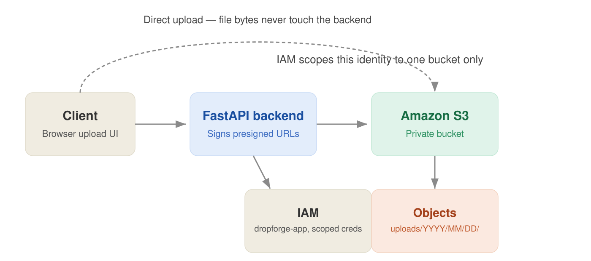
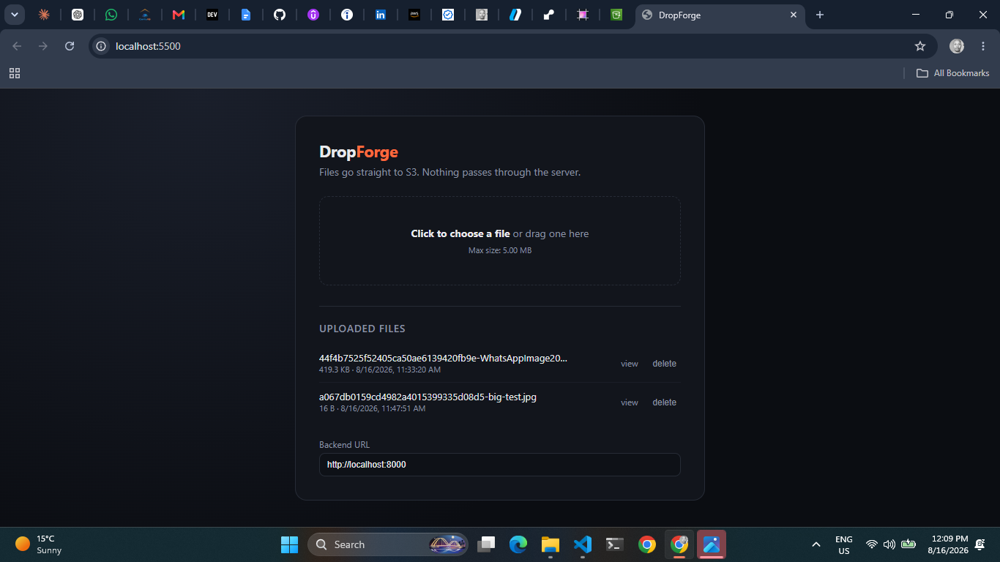
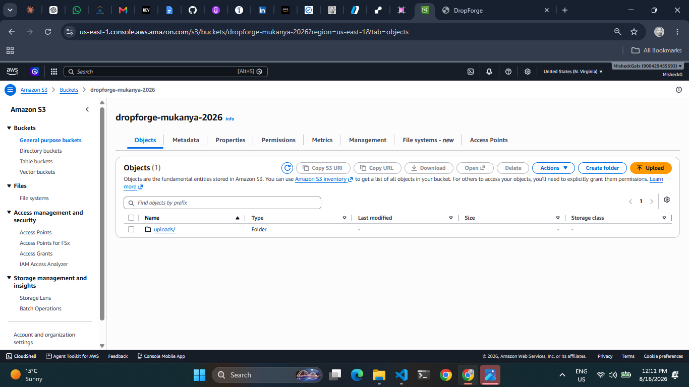
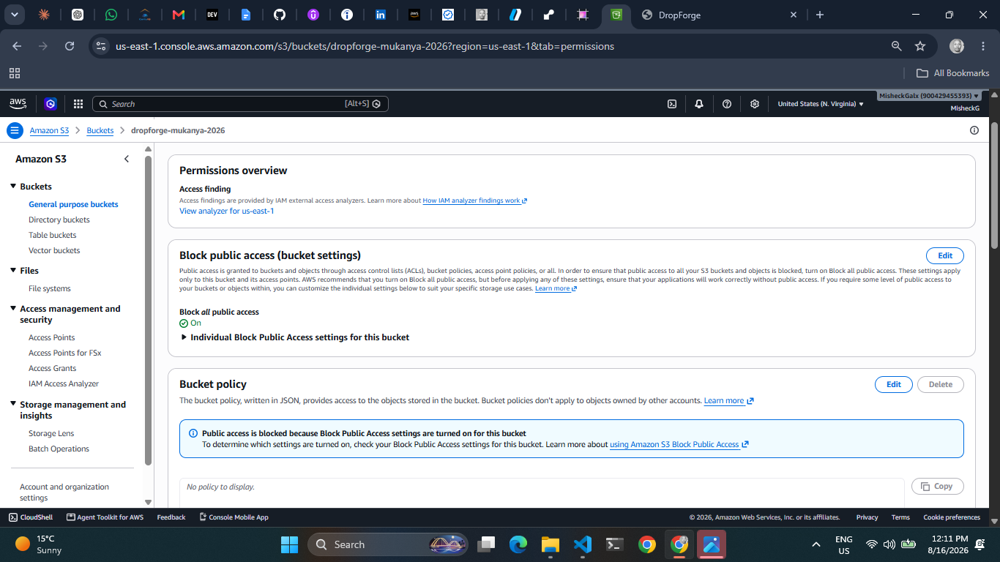
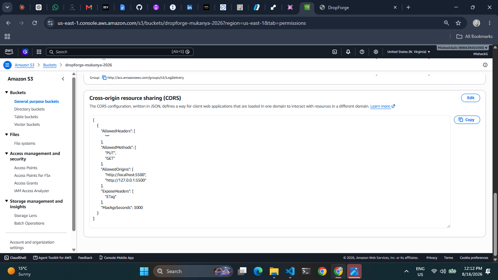
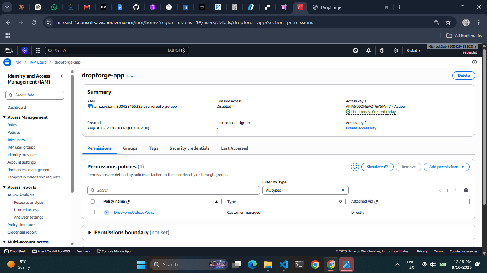
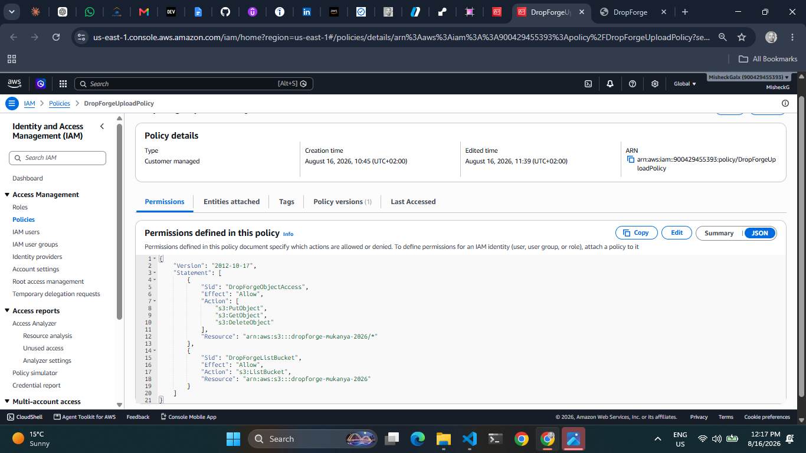

# DropForge

I built this to actually understand the AWS presigned-URL upload pattern — the one where files go straight from the browser to S3 instead of passing through your app server. I'd seen the diagram a dozen times while studying for the Solutions Architect exam, but hadn't built it myself. So I did.

It's a small FastAPI backend that hands out short-lived, signed upload URLs, and a plain HTML/JS frontend that uses them to drop files directly into S3. No AWS keys ever touch the browser. No file bytes ever touch my server.

## How it works



1. You drop a file on the page
2. The browser asks my backend for permission to upload
3. My backend, using a locked-down IAM identity, asks S3 to generate a signed URL
4. The browser uploads the file straight to S3 using that URL

The backend's only job in that whole flow is saying "yes, you're allowed." It never sees the file itself.

## What it actually looks like

**The upload screen:**



**Proof it's really in AWS — the S3 bucket with real uploaded objects:**



**The bucket is locked down — Block Public Access is fully on, nothing is exposed by accident:**



**CORS configured so the browser is allowed to upload directly:**



**A dedicated IAM user for the app, not my personal AWS credentials:**



**And the actual least-privilege policy attached to it — only the four permissions the app needs, nothing more:**



## Why I did it this way

- **The bucket stays private.** Nothing is public. Access only happens through short-lived signed URLs that expire in minutes.
- **The app has its own AWS identity**, separate from my personal admin account. If its credentials ever leaked, the damage is capped at one bucket and a handful of permissions — not my whole AWS account.
- **File size limits are enforced by S3 itself**, not just a check in the browser's JavaScript. I proved this by deliberately uploading a file bigger than the limit and getting a real `EntityTooLarge` rejection back from AWS.
- **Rotating credentials required zero code changes**, because the app reads an AWS CLI profile name from its config, not a hardcoded key.

## Things that actually broke while building this

Worth being honest about, because this is where most of the learning happened:

- CORS wasn't set up at first, and the browser silently blocked every upload even though the signed URL itself was completely valid. Took a while to realize those are two totally different failure points.
- After adding a "list files" feature, `ListBucket` came back `AccessDenied` — which was IAM working correctly, not broken. Turns out listing a bucket needs a different kind of permission than reading or writing objects inside it, with a different resource format entirely.
- Enforcing a real file size limit meant switching from a simple presigned PUT to a presigned POST with a signed policy — a genuinely different upload mechanism, not just a config tweak.

## Stack

Python, FastAPI, boto3, vanilla JS, Amazon S3, IAM.

## Run it yourself

```bash
# backend
cd backend
python3 -m venv venv && source venv/bin/activate
pip install -r requirements.txt
cp .env.example .env   # fill in your own bucket name and AWS profile
uvicorn main:app --reload

# frontend, in a separate terminal
cd frontend
python3 -m http.server 5500
```
